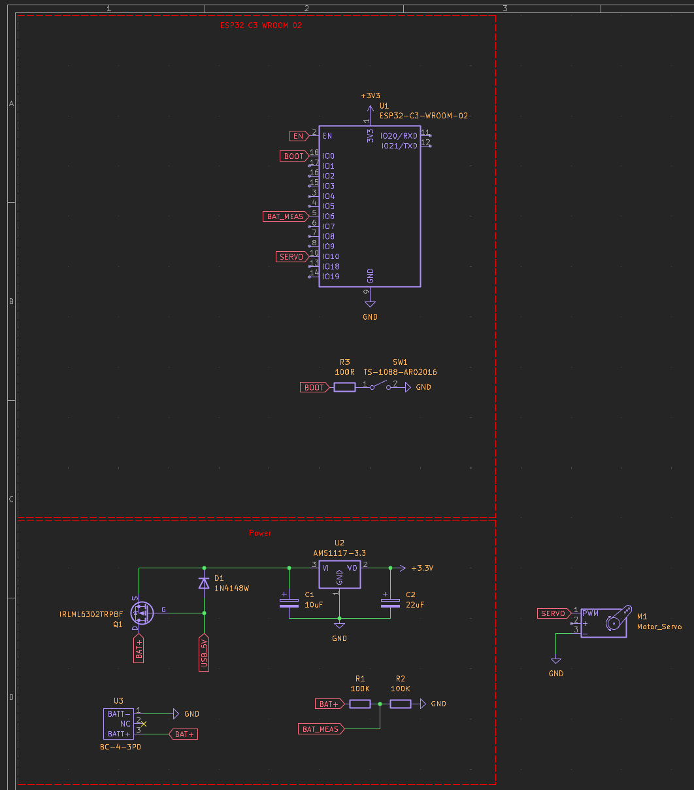
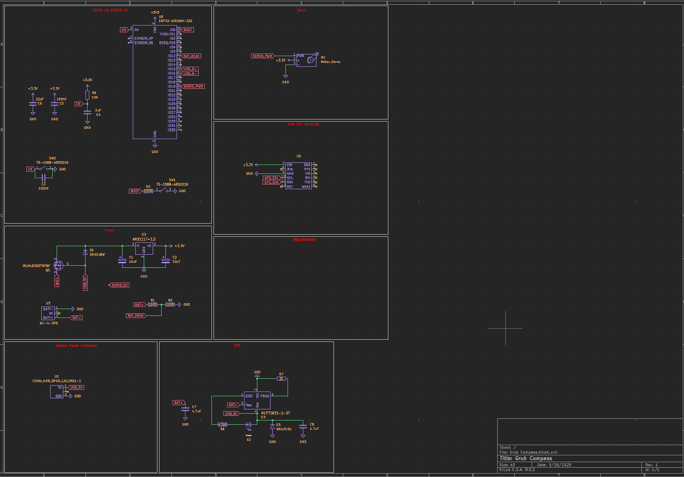
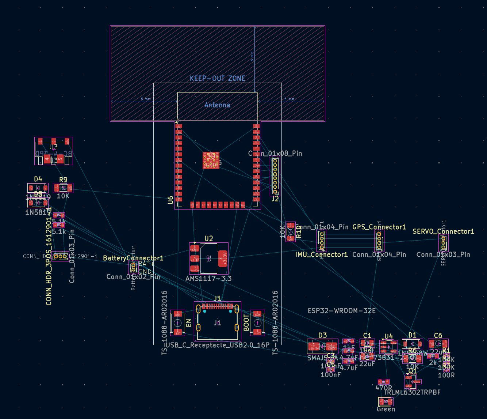
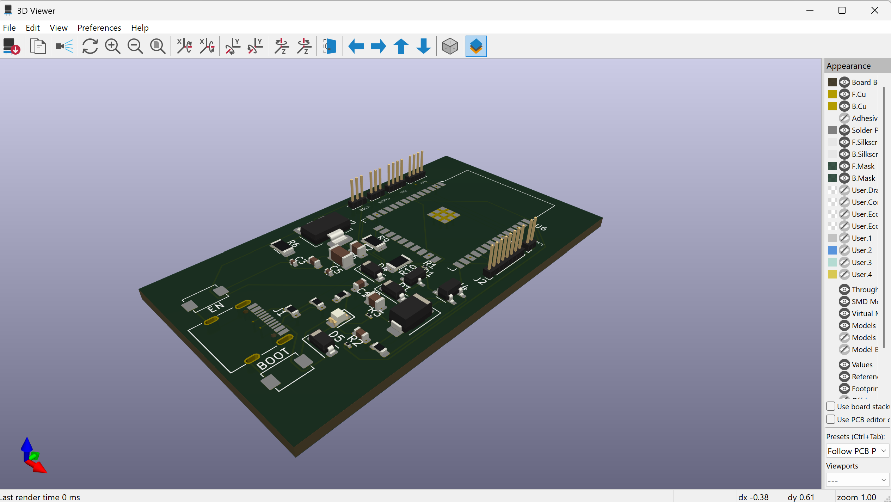

# May 22nd: Researching hardware

Today, I decided upon my project and started researching the hardware I'll need. I decided that I'm going to have two components: the compass and the dock. The dock will be built on a Raspberry Pi Zero 2 W and the compass will be on an ESP32. 

**Total time spent: 1h**

# May 23rd: Script Building

I'm still waiting on some parts, so I started learning about the Google Places and Geolocation APIs. I built the basic script that the Raspberry PI on the docking device will need to run.

](img/image.png)

**Total time spent: 1.5hrs**

# May 23rd: PCB Design Day 1

Today, I started designing my PCB in KiCAD. A lot of the time, I was just reading datasheets to understand what parts I'll need. Most of my focus was on the power system since I want my compass to work off battery as well as USB-C

**Total time spent: 4hrs**

# May 28th: PCB Design Day 2

I've been working more on the PCB design and have changed some choices around how I'm going to wire my sensors. I'll still have a seperate dock/compass, but the custom PCB for the compass won't have the GPS directly wired to it (I already have an Adafruit GPS, so I can save money). I'm still deciding if I want to wire the IMU as a seperate board or build it in.

I also changed some stuff in my power system. Instead of having a USB-C input on the compass, I'm going to have it charge from the dock on a three pin connector.

**Total time spend: 4.5hrs**

# June 6th: PCB Design Day 3

I've taken a bit of a break but I'm finishing up my custom PCB. I want to be able to use the ESP32 for other projects in the future so I but a bunch of headers for future projects. I'm also using headers for the power supply, servo, gps, and imu. I've also started designing the compass in Fusion.

# July 28th: Project Reset

I've taking another big break from this project, and I'm coming at it from a different angle. My original workflow was complicated and not easily scalable. For a shot period during July, I tried to restart, trying to get things to work with the raspi and sensors. I learned a lot during this period and have a better idea of how to reach my goals.

My first design used two components, the dock and the compass, which would communicate with each other. I now plan to have only one device that does everything. This will reduce complexity and costs. This also eliminates the need for a raspi, meaning tht the project will be more scalable with an ESP32.

I am ordering an ESP32 breakout board and a magnetometer since my last one was a cheap QMC5883l copy and didn't work with any of the python libraries I was using. I'm also switching to C++ because I'd like to learn a new language, it's faster, and more memory efficient.

I'm also going the make a server with Flask that handles API calls instead of that being a client side thing. Though, I'll handle that later